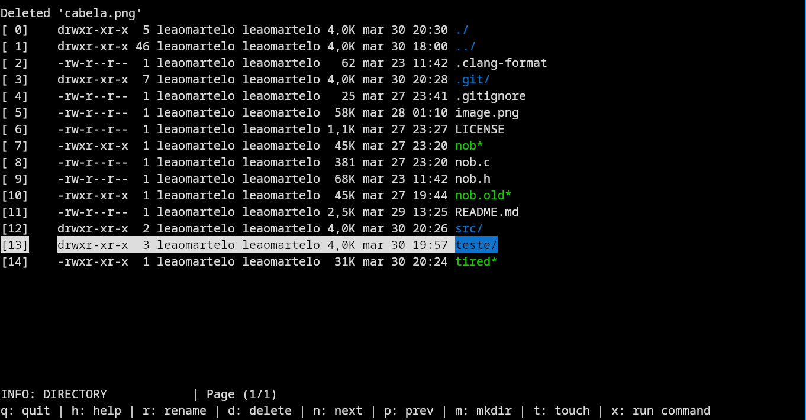

# Tired

## A Emacs Dired clone, as a standalone application for your terminal 

Tired is a clone of the [Dired](https://wikemacs.org/wiki/Dired) file browser of Emacs, but remade as a standalone application for the terminal.

Keep in mind this is made through the eyes of someone who has opened Emacs twice i think

(Terminal dIRED -> Tired)

> [!WARNING]
> This repository has been re-uploaded, as I managed to nuke the git repo :D



<sub>(Tired being used to display the root of the project)</sub>

> [!NOTE]
> This is very buggy made with only my use case in mind.\
> Don't be afraid of making pull requests of new USEFUL functionality or fixing bugs.

> [!WARNING]
> This CAN and WILL crash on directories with `spaces` on their name, and in most cases files aswell.\
> This is a `wontfix` for now, as you should not be doing that on the first place.

## Configuring and building

### Configuring

Tired follows a similar structure to [suckless software](https://suckless.org/) (but this one still sucks a lot), where
all the configuration is done before compiling.

To modify configurations such as `Keybindings`, `Colors` and `page sizes`
visit the `src/config.h` file.

The configuration file contains pretty much all the information you need to configure the project to your liking.
You can make your own extensions of it to modify /  add functionality you might desire.

To reset the default configuration with (assuming you're at the root of the project)
```shell
cp src/config.h.def src/config.h
```

### Building

This project uses the [nob.h](https://github.com/tsoding/nob.h) build system, be sure to check it out.

The only real `requireaments` for the project are `ncurses library` and a `c compiler`.

To first build the project you need to bootstrap the build system. That is made very easy with the nob.

```shell
cc nob.c -o nob && ./nob
```
After that, every time you need to re-compile to project just simply run
```shell
./nob
```
again and the project will be recompiled with updated settings.


## Using Tired

#### Assuming default Keybindings:

Press `h` at any moment to open the help menu.

Navigate arround with the `arrow keys`.

Press `Enter` to open a directory / run a executable.

Press `Backspace` to go up a directory.

Press `g` and type a number, this will switch your selection to the file with the same number at the [square brackets]

Too much files to fit in the screen? Press `n` and `p` to navigate between next and previous pages.
